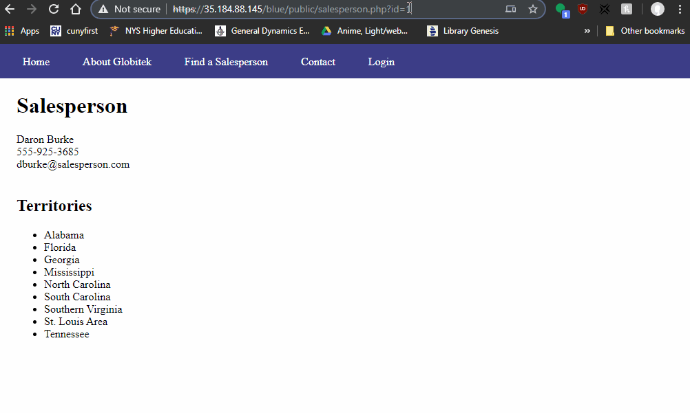
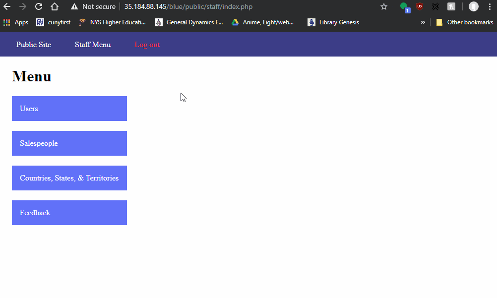
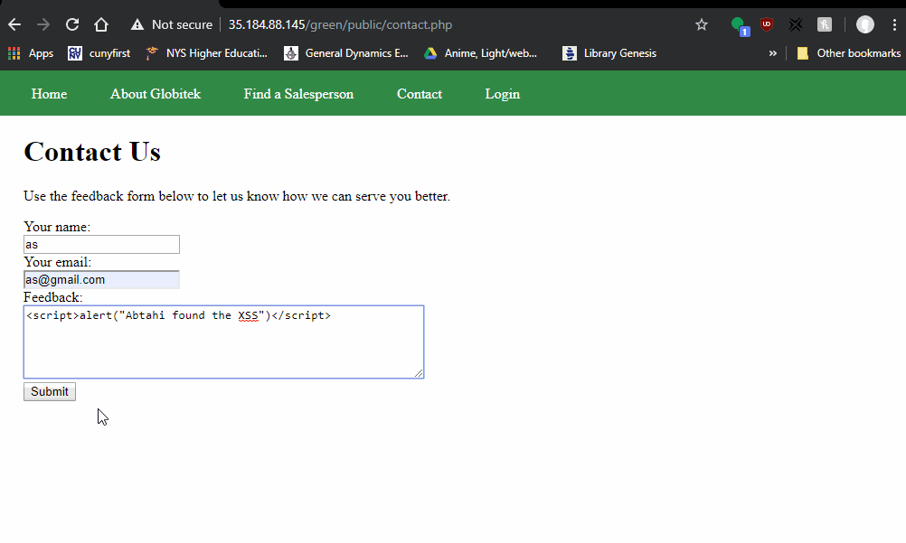
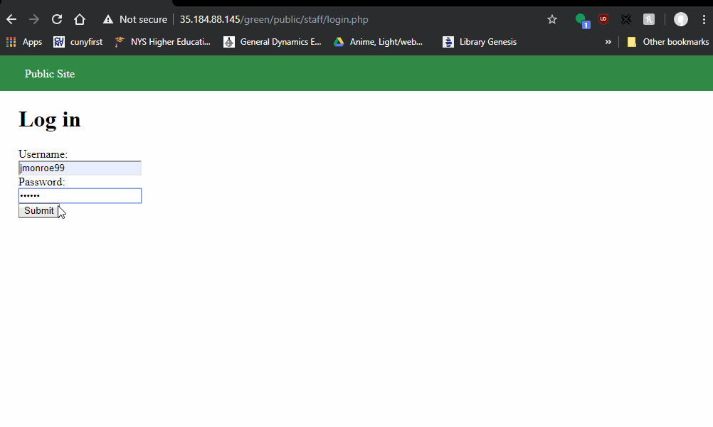
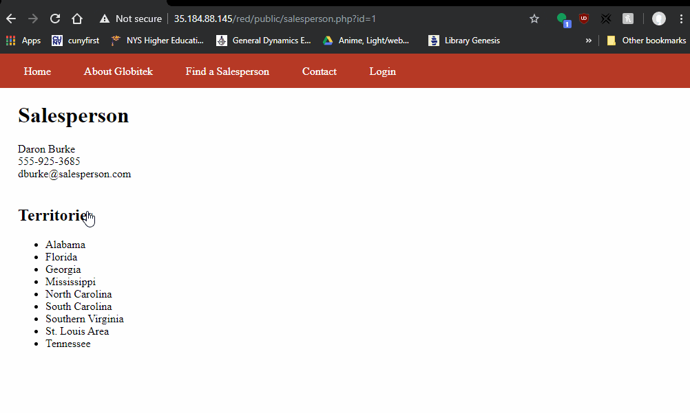
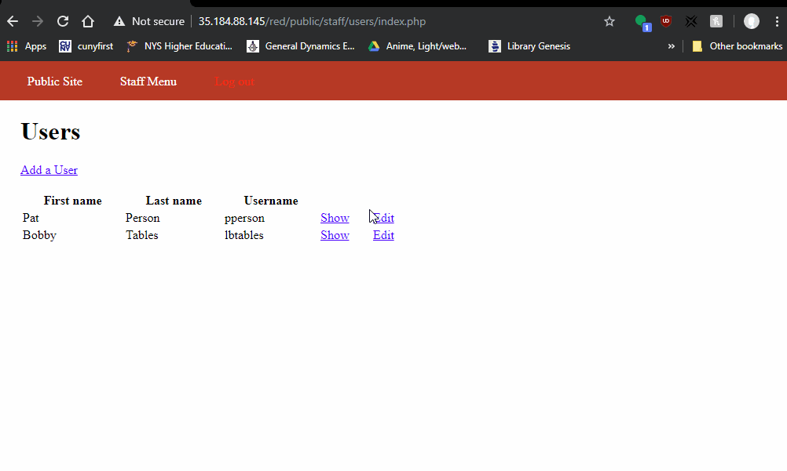

# websecurity_week9

# Project 8 - Pentesting Live Targets

Time spent: **5** hours spent in total

> Objective: Identify vulnerabilities in three different versions of the Globitek website: blue, green, and red.

The six possible exploits are:

* Username Enumeration
* Insecure Direct Object Reference (IDOR)
* SQL Injection (SQLi)
* Cross-Site Scripting (XSS)
* Cross-Site Request Forgery (CSRF)
* Session Hijacking/Fixation

Each color is vulnerable to only 2 of the 6 possible exploits. First discover which color has the specific vulnerability, then write a short description of how to exploit it, and finally demonstrate it using screenshots compiled into a GIF.

## Blue

Vulnerability #1: SQL Injection
 - GIF Walkthrough:
	
 - Comment: Entering an sql injection into the blue site will cause a database failure whereas the other sites don't.
 - Steps to recreate:
	- navigate to https://35.184.88.145/blue/public/salesperson.php?id=1
	- set id equal to 'OR 1=1' --

Vulnerability #2: Session Hijacking/Fixation
 - GIF Walkthrough:
	
 - Comment: Using the same session id on a different browser will allow you to login automatically to the account on that browser. This doesn't happen on the green and red site.
 - Steps to recreate:
	- navigate to https://35.184.88.145/blue/public/staff/login.php
	- login with pperson and StaR!49*whiz
	- navigate to https://35.184.88.145/blue/public/hacktools/change_session_id.php on the current browser and on another browser
	- change the session id of the other browser to the id of the current browser
	- navigate to https://35.184.88.145/blue/public/staff/login.php on the other bowser
	
## Green

Vulnerability #1: Cross-Site Scripting
 - GIF Walkthrough:
	
 - Comment: The green site has a XSS vulnerability whereas the other sites don't.
 - Steps to recreate:
	- navigate to https://35.184.88.145/green/public/contact.php
	- enter some javascript into the feedback section
	- click submit then login and go to feedback
	
Vulnerability #2: User Enumeration
 - GIF Walkthrough:
	
 - Comment: In the green site, if an existing username and wrong password is given, the "Log in was unsuccessful" will be bolded. If a nonexisting username and wrong password is given, the "Log in was unsuccessful" will not be bolded. This is not present in the other sites.
 - Steps to recreate:
	- navigate to https://35.184.88.145/green/public/staff/login.php
	- enter in an existing username and wrong password
	- enter in a nonexisting username and wrong password

## Red

Vulnerability #1: Insecure Direct Object Referencing
 - GIF Walkthrough:
	
 - Comment: In the red site salesperson pages, changing the id parameter on the URL to 10 will show a non-public salesperson. This is not present in the other sites.
 - Steps to recreate:
	- navigate to https://35.184.88.145/red/public/territories.php
	- click on a salesperson
	- change the id in the URL to 10
	
Vulnerability #2: Cross-Site Request Forgery
 - GIF Walkthrough:
	
 - Comment: In the red site, using inspect element, the value of the hidden csrf_token can be changes. This is not present in the other sites.
 - Steps to recreate:
	- navigate to https://35.184.88.145/red/public/staff/login.php
	- login with pperson and StaR!49*whiz
	- click on users and edit on any entry
	- open inspect element and change the value of the hidden csrf_token
	- click update

## Notes

Describe any challenges encountered while doing the work

